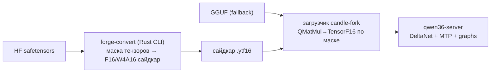

# Project Brief — yttri-forge

Версия 1.0 · 2026-08-24 · Статус: черновик к утверждению
Связанные: [interview-log.md](interview-log.md) · [decisions.md](decisions.md) · [open-questions.md](open-questions.md) · [research.md](research.md)

## 1. Суть проекта

Собственный конвейер весов для инференс-стека Yttri:
`BASE (HF safetensors) → yttri-формат (конвертер на Rust) → загрузчик в candle-fork → наши ядра`.

Цель — выйти из чужой экосистемы (GGUF + кванты llama.cpp), где мы структурно
догоняем ×1.1–1.35, и получить **преимущество**: per-tensor форматы (декод —
2–4 bit bandwidth-bound; префилл — W4A16/W8A8 tensor-core bound), layout под
наши ядра, калибровка под coding.

## 2. Проблема

Стек потребляет GGUF и портирует ядра llama.cpp. Их формат выверен под их ядра
годами — мы вечно ×1.3 позади по декоду длинного контекста и ×1.3 по префиллу.
Замеры: см. [research.md](research.md).

## 3. Пользователи

**Владелец (Askid)** — единственный пользователь инструмента: конвертирует
модели CLI-командой, сервер ест результат. Агенты (Codex/OpenCode) потребляют
API сервера — для них формат прозрачен.

## 4. Решение (видение)

Этапы:

| Этап | Что | Критерий выхода |
|---|---|---|
| **0. Профиль префилла** (спайк, до конвертера) | разбив prefill @8K: matmul / attention / DeltaNet | подтверждено, что matmul-проекции ≥40% времени; иначе пересмотр цели |
| **1. Гибрид** (до аренды) | Rust CLI: маска тензоров → F16-сайдкар; загрузчик: **prefill-only dual-read** — F16 для forward_prefill, GGUF-квант для decode | На Qwen3.5-4B @8K: префилл > llama.cpp (2480 ток/с); декод ≥ baseline 56 ток/с |
| **2. W4A16** (после аренды) | tensor-core ядра W4A16 для префилла; решение по калибровке отложено до этапа | префилл ×2 от GGUF-пути |
| **3. Свой формат** | версионированный контейнер, экстensible по тензорным типам | полный отказ от GGUF-пути |

## 5. Scope v1 (этап 1)

**Must:** CLI `forge-convert --f16-attn-all model.safetensors → .ytf16`
(бинарный флаг; glob-маска в этапе 1.5); загрузчик с **dual-read**: prefill
читает F16-сайдкар, decode — GGUF-квант (иначе bandwidth-bound декод падает,
см. риски R-DUAL); один sha256 на сайдкар; замеры vs baseline vs llama.cpp;
golden-тесты: 3 промпта осмысленно + loss@64tok < порог.
**Should:** glob-маска; trace замапленных тензоров.
**Out:** автовыбор тензоров; W4A16; обратный конвертер (решение BD-002);
PyTorch-чекпоинты как вход (BD-003); мультимодальный mmproj — поддерживается
как обычные тензоры по маске (BD-001), отдельной логики нет.

## 6. Дифференциация

Цель — **обойти всех** (BD-005) на нашем стеке: DeltaNet-гибриды Qwen3.5/3.8 +
MTP + single-user RTX — ниша, которой нет у vLLM/TensorRT-LLM (батч-серверы) и
llama.cpp (последовательный MTP, без fused DeltaNet).

## 7. Ограничения

Один разработчик; приватный репозиторий; этап 1 строго **до аренды 48GB**
(честные замеры ядер на слабом железе); Rust-only конвертер (BD-004).

## 8. Риски

| Риск | Митигация |
|---|---|
| **R-DUAL (HIGH)**: F16-чтение на декоде удвоит bandwidth → декод рухнет | dual-read by design: F16 только forward_prefill; тест «декод ≥ baseline» обязателен |
| **R-TARGET (HIGH)**: bottleneck префилла не в matmul (FA2/DeltaNet доминируют) | этап 0: профиль префилла по фазам ДО конвертера; gate ≥40% matmul |
| Сложность W4A16 (tensor cores требуют точного layout) | стартовать с готовых AWQ-портов; golden-тесты каждый шаг |
| Расхождение сайдкара с GGUF (другая версия модели) → мусор | sha256 сайдкара + привязка к hash GGUF в манифесте |
| Долгий хвост («обойти всех») | жёсткие критерии выхода каждого этапа; этап без критерия = стоп |
| Смена архитектур Qwen | версионированный формат, extensible тензорные типы |

## 9. Критерии успеха MVP

1. Prefill Qwen3.5-4B @8K > 2480 ток/с (быстрее llama.cpp 2480)
2. Decode @8K ≥ 56 ток/с (не хуже baseline без сайдкара)
3. Logits parity ≤ 1e-2 против GGUF-пути на фиксированном промпте
