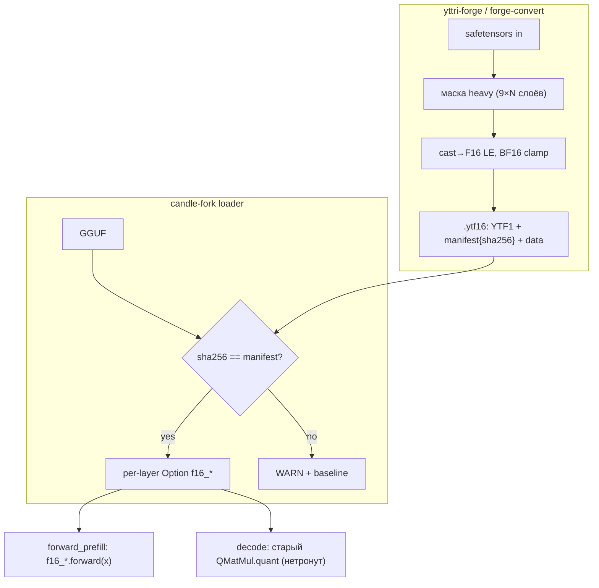

# Plan: yttri-forge Этап 1 — F16-сайдкар тяжёлых проекций

**Date:** 2026-08-24
**Status:** 🚧 Конвертер починен, качество восстановлено
**Priority:** P1
**Specification:** [docs/specs/2026-08-24-stage1-f16-sidecar.md](../specs/2026-08-24-stage1-f16-sidecar.md)

## Goal

Prefill @8K ≥2480 ток/с (> llama.cpp) на Qwen3.5-4B; decode ≥56 ток/с;
golden-тесты зелёные. Откат одним env-флагом.

## Current state

- Форк `47fe1094`: GPROF=3 профилирование префилла ([pfp-delta]/[pfp-attn]).
- Matmul = 59% префилла; маска heavy = 9 тензоров/слой.
- `QMatMul` имеет вариант `TensorF16` — F16-matmul готов, переиспользуем.
- Dual-read нельзя делать подменой QMatMul (decode тоже пойдёт в F16) →
  отдельное `Option<QMatMul>` поле per-layer, используется ТОЛЬКО в prefill.

## Solution architecture

## Solution

### Layer 1 — Конвертер (`forge-convert`, этот репо)

#### Files:
- [ ] `Cargo.toml` — workspace: bin `forge-convert`; deps: safetensors, serde_json, sha2, clap
- [ ] `src/main.rs` — CLI: `--f16-heavy <st> [-o dir] [--gguf-hash <sha|path>] [--list]`
- [ ] `src/container.rs` — write/read `.ytf16` (YTF1, align 64, manifest JSON)
- [ ] `src/mask.rs` — heavy-маска: резолв имён `blk.{i}.{tensor}` по метаданным safetensors

#### Tasks:
- [ ] container.rs round-trip unit-тест (write→read байт-в-байт)
- [ ] mask.rs: генерация имён по block_count из имени первого `blk.0.*`
- [ ] BF16→F16 clamp + счётчик клампов в stdout (FR-003)
- [ ] sha256 GGUF (если передан путь) или приём готового hex
- [ ] `--list` (FR-010)

**Independent check:** `forge-convert --f16-heavy m.safetensors -o out/ && forge-convert --list out/m.ytf16` показывает 9×N тензоров; повторный запуск → идентичный sha256 файла.

### Layer 2 — Парсер .ytf16 в candle-fork

#### Files:
- [ ] `candle-fork/qwen35-batch/src/real/ytf16.rs` (новый) — read: header/manifest/data; доступ tensor(name)->(shape, f16 bytes)
- [ ] `qwen35-batch/src/real/mod.rs` — pub mod ytf16;

#### Tasks:
- [ ] Юнит-тест: файл из Layer 1 читается, формы совпадают
- [ ] Ошибка версии/magic → понятный ERROR

**Independent check:** cargo test -p qwen35-batch ytf16 (на macOS локально).

### Layer 3 — Интеграция загрузчика (dual-read)

#### Files:
- [ ] `model_weights.rs` from_gguf/build_model_common: после загрузки — детект `<stem>.ytf16`, sha256-check, `QWEN36_DISABLE_YTF16` gate
- [ ] `GatedAttentionLayer`: `f16_q/k/v/o: Option<QMatMul>` (TensorF16-вариант)
- [ ] `DeltaNetLayer`: `f16_wqkv/wgate/w_beta/w_alpha/ssm_out: Option<QMatMul>`
- [ ] Trace `[ytf] mapped {n} tensors ({MiB})` (FR-011)

#### Tasks:
- [ ] Детект+валидация: sha256, формы vs GGUF-метаданные (mismatch → ERROR)
- [ ] Маппинг в поля слоёв; отсутствие части тензоров → WARN+baseline
- [ ] Env-откат FR-006

**Independent check:** сервер стартует с сайдкаром: `[ytf] mapped 288 tensors`; с битым sha256 — WARN и обычная работа.

### Layer 4 — Dual-read prefill

#### Files:
- [ ] `GatedAttentionLayer::forward_attn_with_rope` — prefill-ветка: proj через `f16_*`, FA2-ветка wo через `f16_o`; decode-ветки не трогаем
- [ ] `DeltaNetLayer::forward_prefill` — 4 proj + ssm_out через `f16_*`

#### Tasks:
- [ ] Prefill-вызовы: `if let Some(m)=&self.f16_x { m.forward(x)? } else { старый путь }`
- [ ] Decode-пути не изменены (grep-аудит: f16_* упоминается только в *prefill*)
- [ ] Trace-сторож FR-005: обращение к f16 вне prefill → WARN

**Independent check:** bench SLOTS=2+graphs: decode ≥56 ток/с; `[ytf]` trace не показывает вне-prefill обращений.

### Layer 5 — Замеры + golden (приёмка)

#### Files:
- [ ] `scripts/bench_stage1.ps1` (yttri-win) — матрица: baseline / +ytf16 / +DISABLE_YTF16
- [ ] golden-промпты ×3 + loss@64tok скрипт

#### Tasks:
- [ ] Prefill ≥2480 ток/с? Decode ≥56? Golden зелёный?
- [ ] Откат-тест: DISABLE_YTF16 → числа равны baseline
- [ ] Итоги в research.md форге

**Independent check:** все критерии Scenario 3 спеки зелёные.

## Implementation phases

### Phase 1: Контейнер + конвертер (estimate: 6h) — ✅ ГОТОВО (c660591)
см. Layer 1. **Check:** round-trip + --list.
Реализовано: workspace forge-convert, container.rs (YTF1, стриминг+finalize-patch),
mask.rs (реальные имена: linear_attn.in_proj_*/out_proj + self_attn.*_proj),
main.rs (--f16-heavy/--list/--gguf/-o, BF16 clamp). Тест round-trip зелёный.
УТОЧНЕНО ПО ФАКТУ: heavy = 24×5 DeltaNet + 8×4 attn = 152 тензора (не 9 групп имён).

### Phase 2: Парсер в форке (estimate: 4h) — ✅ ГОТОВО
см. Layer 2. **Check:** юнит-тест round-trip.
Реализовано: real/ytf16.rs (mmap Reader, manifest через serde_json::Value — без нового dep);
tests/ytf16_compat.rs — независимый hand-built writer проверяет совместимость форматов. 2/2 green.
Форк-коммит после c660591.

### Phase 3: Загрузчик + мапинг (estimate: 6h) — ✅ ГОТОВО
см. Layer 3. **Check:** лог mapped/WARN.
Реализовано: ModelWeights::attach_ytf16 (sha256 GGUF, per-layer Option<QMatMul> TensorF16,
device из адаптера), вызов из adapter.load после загрузки модели.
ВНИМАНИЕ (методология): сборка/тесты — на yttri-win через VS DevCmd (nvcc требует cl.exe);
локальный test_ytf16.bat обёртка с окружением. Дубликат paged_window устранён.

### Phase 4: Dual-read prefill (estimate: 8h)
см. Layer 4. **Check:** decode-regression нет.

### Phase 5: Приёмка (estimate: 4h)
см. Layer 5. **Check:** success criteria спеки.

## Traceability

| Requirement | Phase |
|---|---|
| FR-001 контейнер | 1, 2 |
| FR-002 маска heavy | 1 |
| FR-003 CLI+BF16 clamp | 1 |
| FR-004 обнаружение+мапинг | 3 |
| FR-005 dual-read | 4 |
| FR-006 откат env | 3 |
| FR-010/011 list/trace | 1, 3 |
| Success criteria | 5 |

## Risks

| Risk | Mitigation |
|---|---|
| Имена тензоров safetensors ≠ GGUF-конвенции | Layer 1 --list сверяет с ожидаемыми; ошибка с именем |
| F16 протекает в decode | grep-аудит + trace-сторож (Layer 4) |
| sha256 долгий (10GB ~15с) | считать лениво при первом decode; кэш в манифесте |
| BF16 outlier overflow | clamp + счётчик (FR-003); loss-golden поймает порчу |

## Plan decisions

| # | Вопрос | Решение | Дата |
|---|--------|---------|------|
| PD-101 | Как dual-read без ломания типов? | Option<QMatMul> (TensorF16) рядом с основным QMatMul; prefill-ветки используют f16_*, decode — старые | 2026-08-24 |
| PD-102 | Где живёт sha256 GGUF? | В манифесте сайдкара; загрузчик пересчитывает лениво и кэширует | 2026-08-24 |

## Deferred questions

| Question | Why deferred | When | Who |
|---|---|---|---|
| Glob-маски произвольных тензоров | этап 1.5 | после приёмки | владелец |

## Приёмка сайдкара (2026-08-25, 4B Q4_K_M, RTX 3060)

Первая сборка сайдкара давала **непригодные веса**, и это не ловилось ничем:
sha256 GGUF сходился, размеры и формы сходились, сервер стартовал. Симптом
вылезал только в рантайме — префилл выдавал `248320/248320` не-финитных
логитов на чанках T≥64, сэмплер брал мусорный первый токен, генерация
вырождалась в повтор одного токена (при `QWEN36_DISABLE_YTF16=1` всё было
нормально).

### Два бага конвертера

1. **Смещения тензоров safetensors.** `find_tensor_info` брал `data_offsets`
   как абсолютные смещения в файле, но они отсчитываются от начала секции
   данных (после `n+8` байт заголовка); `read_metadata` возвращает `n`, и оно
   выбрасывалось в `_off`. Каждый тензор писался со сдвигом на размер
   заголовка — распределение похожее, значения чужие. Косвенный признак,
   который был виден и раньше: `clamped_bf16: 488` (весов такой величины не
   бывает — клампались куски чужих данных).

2. **Порядок голов v/z/a/b.** HF пакует их по группам k-голов (индекс головы
   `g*n_per_k + j`), llama.cpp в GGUF ждёт j-major (`j*n_k + g`);
   `out_proj` принимает v-пространство, поэтому его столбцы переставляются тем
   же законом. Раскладка (`n_k=16, n_v=32, head=128`) читается из config.json.
   До фикса совпадали только q/k (строки 0..4095 fused qkv) и проекции
   attention-слоёв.

### Расхождение с GGUF (mean|diff| по блоку 0)

| Тензор | было (баг 1) | после фикса смещений | после фикса голов |
|---|---|---|---|
| attn_q (attention) | 0.0164 | **0.00086** | 0.00086 |
| attn_qkv (q/k строки) | 0.0145 | 0.0004 | 0.00039 |
| attn_qkv (v-хвост) | 0.0145 | 0.0124 | **0.00039** |
| attn_z | 0.0148 | 0.0148 | **0.00084** |
| attn_a / attn_b | — | — | **0.0015 / 0.0006** |
| attn_out | — | — | **0.00071** |

0.0004…0.0015 = ошибка квантования Q4_K (относительная — 3.9%).

### Сторожа (чтобы не повторилось)

- `[ytf] blk.0 vs GGUF: относительная ошибка N%` — считается **всегда** при
  загрузке; >25% → WARN с указанием на конвертер. Порог относительный, чтобы
  работал и на IQ2.
- `[pfa] WARN non-finite logits` — не-финитные логиты чанка префилла.
- `QWEN36_YTF16_AUDIT=1` — подробный разбор (форма, max/mean, ошибка по восьми
  блокам строк) по первым блокам.
- Юнит-тесты конвертера: `tensor_offsets_are_relative_to_data_section`,
  `deinterleave_maps_hf_head_order_to_gguf`, `deinterleave_cols_permutes_within_each_row`,
  `repack_qkv_keeps_q_and_k`.

### Скорость (GPROF=3, сумма proj по DeltaNet-слоям, 3 запроса @1910 ток.)

| Конфигурация | proj | prefill wall @1910 | @8910 |
|---|---|---|---|
| GGUF Q4_K MMQ (сайдкар off) | 1201 мс | 1.19 с | 4.81 с |
| ytf16, аккумуляция F32 (дефолт) | 1405 мс (+17%) | 1.32 с | 5.07 с |
| ytf16, аккумуляция F16 (`QWEN36_F16_FAST_ACC=1`) | 1242 мс (+3%) | 1.40 с | — |

На 3060 + Q4_K дуал-рид **не даёт скорости**: F16-GEMM с F32-аккумуляцией на
Ampere вдвое медленнее пикового, а MMQ Q4_K уже хорошо оптимизирован. С
`QWEN36_F16_FAST_ACC=1` (CUBLAS_COMPUTE_16F) выходит паритет по скорости.
Выигрыш качества при этом реальный: префилл считается по неквантованным весам.

Гипотеза для проверки на цели (27B, IQ2): там квант-matmul существенно
медленнее, и F16-путь должен выигрывать и по времени — замерить на 48GB-стенде.

### Ответ модели (промпт 1910 ток., 32 токена)

Сайдкар on/off дают связный, почти совпадающий текст (расхождение — с
середины первого абзаца, ожидаемо: веса префилла разные).
