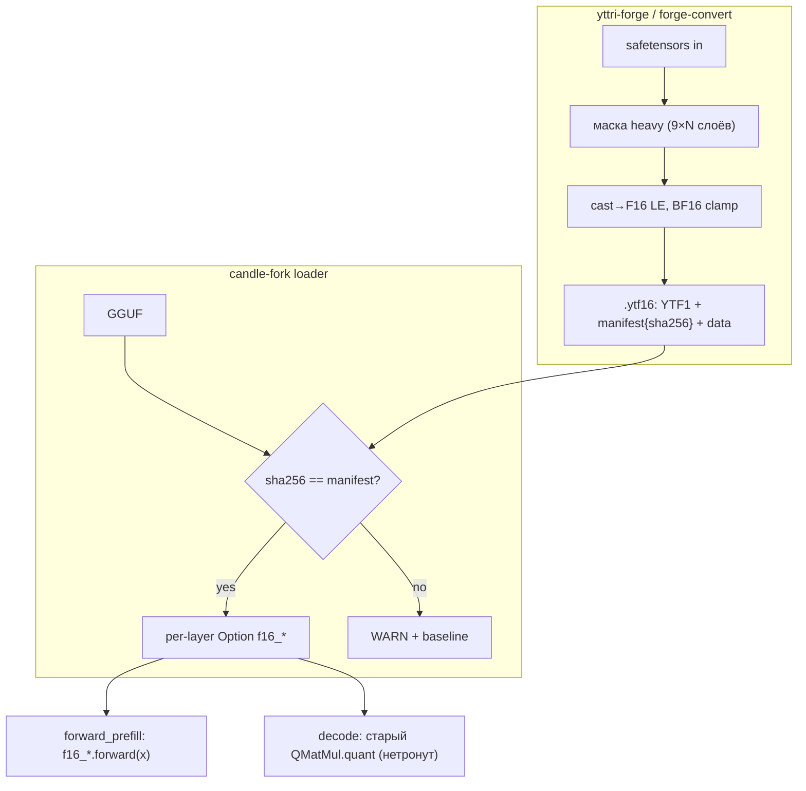

# Plan: yttri-forge Этап 1 — F16-сайдкар тяжёлых проекций

**Date:** 2026-08-24
**Status:** 🚧 Конвертер починен, качество восстановлено
**Priority:** P1
**Specification:** [docs/specs/2026-08-24-stage1-f16-sidecar.md](../specs/2026-08-24-stage1-f16-sidecar.md)

## Goal

Prefill @8K ≥2480 ток/с (> llama.cpp) на Qwen3.5-4B; decode ≥56 ток/с;
golden-тесты зелёные. Откат одним env-флагом.

## Current state

- Форк `47fe1094`: GPROF=3 профилирование префилла ([pfp-delta]/[pfp-attn]).
- Matmul = 59% префилла; маска heavy = 9 тензоров/слой.
- `QMatMul` имеет вариант `TensorF16` — F16-matmul готов, переиспользуем.
- Dual-read нельзя делать подменой QMatMul (decode тоже пойдёт в F16) →
  отдельное `Option<QMatMul>` поле per-layer, используется ТОЛЬКО в prefill.

## Solution architecture



## Solution

### Layer 1 — Конвертер (`forge-convert`, этот репо)

#### Files:
- [ ] `Cargo.toml` — workspace: bin `forge-convert`; deps: safetensors, serde_json, sha2, clap
- [ ] `src/main.rs` — CLI: `--f16-heavy <st> [-o dir] [--gguf-hash <sha|path>] [--list]`
- [ ] `src/container.rs` — write/read `.ytf16` (YTF1, align 64, manifest JSON)
- [ ] `src/mask.rs` — heavy-маска: резолв имён `blk.{i}.{tensor}` по метаданным safetensors

#### Tasks:
- [ ] container.rs round-trip unit-тест (write→read байт-в-байт)
- [ ] mask.rs: генерация имён по block_count из имени первого `blk.0.*`
- [ ] BF16→F16 clamp + счётчик клампов в stdout (FR-003)
- [ ] sha256 GGUF (если передан путь) или приём готового hex
- [ ] `--list` (FR-010)

**Independent check:** `forge-convert --f16-heavy m.safetensors -o out/ && forge-convert --list out/m.ytf16` показывает 9×N тензоров; повторный запуск → идентичный sha256 файла.

### Layer 2 — Парсер .ytf16 в candle-fork

#### Files:
- [ ] `candle-fork/qwen35-batch/src/real/ytf16.rs` (новый) — read: header/manifest/data; доступ tensor(name)->(shape, f16 bytes)
- [ ] `qwen35-batch/src/real/mod.rs` — pub mod ytf16;

#### Tasks:
- [ ] Юнит-тест: файл из Layer 1 читается, формы совпадают
- [ ] Ошибка версии/magic → понятный ERROR

**Independent check:** cargo test -p qwen35-batch ytf16 (на macOS локально).

### Layer 3 — Интеграция загрузчика (dual-read)

#### Files:
- [ ] `model_weights.rs` from_gguf/build_model_common: после загрузки — детект `<stem>.ytf16`, sha256-check, `QWEN36_DISABLE_YTF16` gate
- [ ] `GatedAttentionLayer`: `f16_q/k/v/o: Option<QMatMul>` (TensorF16-вариант)
- [ ] `DeltaNetLayer`: `f16_wqkv/wgate/w_beta/w_alpha/ssm_out: Option<QMatMul>`
- [ ] Trace `[ytf] mapped {n} tensors ({MiB})` (FR-011)

#### Tasks:
- [ ] Детект+валидация: sha256, формы vs GGUF-метаданные (mismatch → ERROR)
- [ ] Маппинг в поля слоёв; отсутствие части тензоров → WARN+baseline
- [ ] Env-откат FR-006

**Independent check:** сервер стартует с сайдкаром: `[ytf] mapped 288 tensors`; с битым sha256 — WARN и обычная работа.

### Layer 4 — Dual-read prefill

#### Files:
- [ ] `GatedAttentionLayer::forward_attn_with_rope` — prefill-ветка: proj через `f16_*`, FA2-ветка wo через `f16_o`; decode-ветки не трогаем
- [ ] `DeltaNetLayer::forward_prefill` — 4 proj + ssm_out через `f16_*`

#### Tasks:
- [ ] Prefill-вызовы: `if let Some(m)=&self.f16_x { m.forward(x)? } else { старый путь }`
- [ ] Decode-пути не изменены (grep-аудит: f16_* упоминается только в *prefill*)
- [ ] Trace-сторож FR-005: обращение к f16 вне prefill → WARN

**Independent check:** bench SLOTS=2+graphs: decode ≥56 ток/с; `[ytf]` trace не показывает вне-prefill обращений.

### Layer 5 — Замеры + golden (приёмка)

#### Files:
- [ ] `scripts/bench_stage1.ps1` (yttri-win) — матрица: baseline / +ytf16 / +DISABLE_YTF16
- [ ] golden-промпты ×3 + loss@64tok скрипт

#### Tasks:
- [ ] Prefill ≥2480 ток/с? Decode ≥56? Golden зелёный?
- [ ] Откат-тест: DISABLE_YTF16 → числа равны baseline
- [ ] Итоги в research.md форге

**Independent check:** все критерии Scenario 3 спеки зелёные.

## Implementation phases

### Phase 1: Контейнер + конвертер (estimate: 6h) — ✅ ГОТОВО (c660591)
см. Layer 1. **Check:** round-trip + --list.
Реализовано: workspace forge-convert, container.rs (YTF1, стриминг+finalize-patch),
mask.rs (реальные имена: linear_attn.in_proj_*/out_proj + self_attn.*_proj),
main.rs (--f16-heavy/--list/--gguf/-o, BF16 clamp). Тест round-trip зелёный.
УТОЧНЕНО ПО ФАКТУ: heavy = 24×5 DeltaNet + 8×4 attn = 152 тензора (не 9 групп имён).

### Phase 2: Парсер в форке (estimate: 4h) — ✅ ГОТОВО
см. Layer 2. **Check:** юнит-тест round-trip.
Реализовано: real/ytf16.rs (mmap Reader, manifest через serde_json::Value — без нового dep);
tests/ytf16_compat.rs — независимый hand-built writer проверяет совместимость форматов. 2/2 green.
Форк-коммит после c660591.

### Phase 3: Загрузчик + мапинг (estimate: 6h) — ✅ ГОТОВО
см. Layer 3. **Check:** лог mapped/WARN.
Реализовано: ModelWeights::attach_ytf16 (sha256 GGUF, per-layer Option<QMatMul> TensorF16,
device из адаптера), вызов из adapter.load после загрузки модели.
ВНИМАНИЕ (методология): сборка/тесты — на yttri-win через VS DevCmd (nvcc требует cl.exe);
локальный test_ytf16.bat обёртка с окружением. Дубликат paged_window устранён.

### Phase 4: Dual-read prefill (estimate: 8h)
см. Layer 4. **Check:** decode-regression нет.

### Phase 5: Приёмка (estimate: 4h)
см. Layer 5. **Check:** success criteria спеки.

## Traceability

| Requirement | Phase |
|---|---|
| FR-001 контейнер | 1, 2 |
| FR-002 маска heavy | 1 |
| FR-003 CLI+BF16 clamp | 1 |
| FR-004 обнаружение+мапинг | 3 |
| FR-005 dual-read | 4 |
| FR-006 откат env | 3 |
| FR-010/011 list/trace | 1, 3 |
| Success criteria | 5 |

## Risks

| Risk | Mitigation |
|---|---|
| Имена тензоров safetensors ≠ GGUF-конвенции | Layer 1 --list сверяет с ожидаемыми; ошибка с именем |
| F16 протекает в decode | grep-аудит + trace-сторож (Layer 4) |
| sha256 долгий (10GB ~15с) | считать лениво при первом decode; кэш в манифесте |
| BF16 outlier overflow | clamp + счётчик (FR-003); loss-golden поймает порчу |

## Plan decisions

| # | Вопрос | Решение | Дата |
|---|--------|---------|------|
| PD-101 | Как dual-read без ломания типов? | Option<QMatMul> (TensorF16) рядом с основным QMatMul; prefill-ветки используют f16_*, decode — старые | 2026-08-24 |
| PD-102 | Где живёт sha256 GGUF? | В манифесте сайдкара; загрузчик пересчитывает лениво и кэширует | 2026-08-24 |

## Deferred questions

| Question | Why deferred | When | Who |
|---|---|---|---|
| Glob-маски произвольных тензоров | этап 1.5 | после приёмки | владелец |


## Приёмка сайдкара (2026-08-25, 4B Q4_K_M, RTX 3060)

Первая сборка сайдкара давала **непригодные веса**, и это не ловилось ничем:
sha256 GGUF сходился, размеры и формы сходились, сервер стартовал. Симптом
вылезал только в рантайме — префилл выдавал `248320/248320` не-финитных
логитов на чанках T≥64, сэмплер брал мусорный первый токен, генерация
вырождалась в повтор одного токена (при `QWEN36_DISABLE_YTF16=1` всё было
нормально).

### Два бага конвертера

1. **Смещения тензоров safetensors.** `find_tensor_info` брал `data_offsets`
   как абсолютные смещения в файле, но они отсчитываются от начала секции
   данных (после `n+8` байт заголовка); `read_metadata` возвращает `n`, и оно
   выбрасывалось в `_off`. Каждый тензор писался со сдвигом на размер
   заголовка — распределение похожее, значения чужие. Косвенный признак,
   который был виден и раньше: `clamped_bf16: 488` (весов такой величины не
   бывает — клампались куски чужих данных).

2. **Порядок голов v/z/a/b.** HF пакует их по группам k-голов (индекс головы
   `g*n_per_k + j`), llama.cpp в GGUF ждёт j-major (`j*n_k + g`);
   `out_proj` принимает v-пространство, поэтому его столбцы переставляются тем
   же законом. Раскладка (`n_k=16, n_v=32, head=128`) читается из config.json.
   До фикса совпадали только q/k (строки 0..4095 fused qkv) и проекции
   attention-слоёв.

### Расхождение с GGUF (mean|diff| по блоку 0)

| Тензор | было (баг 1) | после фикса смещений | после фикса голов |
|---|---|---|---|
| attn_q (attention) | 0.0164 | **0.00086** | 0.00086 |
| attn_qkv (q/k строки) | 0.0145 | 0.0004 | 0.00039 |
| attn_qkv (v-хвост) | 0.0145 | 0.0124 | **0.00039** |
| attn_z | 0.0148 | 0.0148 | **0.00084** |
| attn_a / attn_b | — | — | **0.0015 / 0.0006** |
| attn_out | — | — | **0.00071** |

0.0004…0.0015 = ошибка квантования Q4_K (относительная — 3.9%).

### Сторожа (чтобы не повторилось)

- `[ytf] blk.0 vs GGUF: относительная ошибка N%` — считается **всегда** при
  загрузке; >25% → WARN с указанием на конвертер. Порог относительный, чтобы
  работал и на IQ2.
- `[pfa] WARN non-finite logits` — не-финитные логиты чанка префилла.
- `QWEN36_YTF16_AUDIT=1` — подробный разбор (форма, max/mean, ошибка по восьми
  блокам строк) по первым блокам.
- Юнит-тесты конвертера: `tensor_offsets_are_relative_to_data_section`,
  `deinterleave_maps_hf_head_order_to_gguf`, `deinterleave_cols_permutes_within_each_row`,
  `repack_qkv_keeps_q_and_k`.

### Скорость (GPROF=3, сумма proj по DeltaNet-слоям, 3 запроса @1910 ток.)

| Конфигурация | proj | prefill wall @1910 | @8910 |
|---|---|---|---|
| GGUF Q4_K MMQ (сайдкар off) | 1201 мс | 1.19 с | 4.81 с |
| ytf16, аккумуляция F32 (дефолт) | 1405 мс (+17%) | 1.32 с | 5.07 с |
| ytf16, аккумуляция F16 (`QWEN36_F16_FAST_ACC=1`) | 1242 мс (+3%) | 1.40 с | — |

На 3060 + Q4_K дуал-рид **не даёт скорости**: F16-GEMM с F32-аккумуляцией на
Ampere вдвое медленнее пикового, а MMQ Q4_K уже хорошо оптимизирован. С
`QWEN36_F16_FAST_ACC=1` (CUBLAS_COMPUTE_16F) выходит паритет по скорости.
Выигрыш качества при этом реальный: префилл считается по неквантованным весам.

Гипотеза для проверки на цели (27B, IQ2): там квант-matmul существенно
медленнее, и F16-путь должен выигрывать и по времени — замерить на 48GB-стенде.

### Ответ модели (промпт 1910 ток., 32 токена)

Сайдкар on/off дают связный, почти совпадающий текст (расхождение — с
середины первого абзаца, ожидаемо: веса префилла разные).


## Проба FP8 (2026-08-25)

Вопрос: не отказаться ли от F16 в пользу FP8 (E4M3) как основного формата.
Проверено эмуляцией — `forge-convert --f16-heavy --fp8-emulate` квантует веса
поблочно (128 значений, масштаб amax/448) и кладёт результат обратно в F16, так
что рантайм не меняется, а деградация весов — настоящая FP8-я.

| Метрика | Значение |
|---|---|
| Относительная ошибка весов E4M3 (блок 128) | **2.19%** |
| Ошибка Q4_K_M (то, что везём сейчас в GGUF) | 3.9% |
| Не-финитные логиты | 0 |
| Ответ на 1910-токенном промпте | связный, эквивалентен F16-варианту |

Тезис по качеству подтверждается: FP8 с поблочным масштабом точнее нашего
текущего Q4_K почти вдвое. Без масштаба E4M3 обнуляет всё ниже 2^-9 —
типичные веса (~0.01) умерли бы, поблочный масштаб обязателен (тест
`fp8_block_scaling_survives_outlier`).

**Чего FP8 не даст на RTX 3060.** Ampere (sm_86) не имеет тензорных ядер FP8 —
нативный FP8-GEMM начинается с Ada (sm_89) и Hopper. На 3060 FP8 может быть
только форматом хранения с разворотом в F16 перед matmul: экономит VRAM и
полосу (сайдкар 2.61 → 1.31 ГБ), но не считает быстрее. Замер сегодня показал,
что префилл на 3060 упирается в вычисления, а не в полосу (F16 с
`COMPUTE_16F` быстрее F16 с `COMPUTE_32F` на 12%), поэтому ускорения от FP8
здесь ждать не стоит.

Полностью FP8-модель на 12 ГБ невозможна: 27B в FP8 = 27 ГБ. FP8 имеет смысл
как формат dual-read подмножества (тяжёлые проекции префилла) и как основной
формат на 48GB-стенде с Ada/Hopper, где FP8-GEMM нативный.

Файл FP8-эмуляции сохранён рядом: `Qwen3.5-4B-Q4_K_M.ytf16.fp8`.


## Выбор формата сайдкара (2026-08-25): Q8_0, а не F16 и не FP8

Замеры на 4B Q4_K_M / RTX 3060, промпт 1910 токенов, `QWEN36_GPROF=3`
(сумма `proj` по DeltaNet-слоям за 3 запроса) и `nvidia-smi` с загруженной моделью.

| Формат сайдкара | Ошибка весов | proj | VRAM (сверх базовых 3374 МиБ) | Загрузка |
|---|---|---|---|---|
| нет сайдкара (Q4_K из GGUF) | 3.9% | 1218 мс | — | — |
| F16 | 0% (эталон) | 1382 мс | +2822 МиБ | 12.2 с |
| **Q8_0** | **0.58%** | **1106 мс** | **+1952 МиБ** | 19.7 с |
| FP8 E4M3, блок 128 | 2.19% | — | — | — |
| FP8 E4M3, блок 32 | 2.04% | — | — | — |

Q8_0 выигрывает по всем осям сразу: втрое точнее FP8 при том же весе (8 бит),
на 20% быстрее F16 и на 9% быстрее исходного Q4_K-пути, и на 870 МиБ легче F16
в видеопамяти. Причина точности: у E4M3 всего 3 бита мантиссы (8 уровней на
октаву), у Q8_0 — 127 линейных уровней на блок из 32 значений; веса лежат в
узкой полосе вокруг нуля, где линейная сетка на узком блоке сильно выгоднее.
Причина скорости: Q8_0 идёт через готовое fused MMQ-ядро (int8 тензорные ядра),
а F16-GEMM на Ampere с F32-аккумуляцией вдвое ниже пика.

Дефолт — Q8_0; `QWEN36_YTF16_F16=1` возвращает F16 (эталон качества),
`QWEN36_DISABLE_YTF16=1` полностью отключает сайдкар.

Важно: квантовать надо через `QTensor::quantize_onto` (источник на CPU,
хранилище сразу в VRAM). Через обычный `quantize` F16-тензор сначала уезжает в
видеопамять, и его страницы остаются в driver pool: экономия падала с 870 МиБ
до 200 МиБ, `cuMemPoolTrimTo` их не возвращал (WDDM).

Остаётся (когда понадобится): хранить в контейнере сразу Q8_0-блоки — это
уберёт +7.5 с на загрузке (CPU-квантование) и вдвое уменьшит файл (2.61 → 1.4 ГБ).

### Где остаётся место для FP8

На Ampere — нигде: нативных FP8-ядер нет, а как формат хранения FP8 проигрывает
Q8_0 и по точности, и по скорости. FP8 становится интересен на Ada/Hopper
(48GB-стенд), где FP8-GEMM нативный: там сравнивать надо не с Q8_0-хранением, а
с FP8-вычислением — это отдельный замер на арендованной карте.


## Профиль префилла и что из него вышло (2026-08-25, вечер)

### Ошибочная посылка спеки

§1 спеки: «GGUF Q4_K_M матмулы идут через integer MMQ **без tensor cores**».
Это неверно: `engine/candle-kernels/src/mmq_gguf/mmq_mma.cuh` использует
`ldmatrix.sync.aligned` и MMA — те же тензорные ядра, только int8. Поэтому
переход на F16 не мог дать ускорения и не дал: F16 медленнее MMQ.

### Анатомия чанка (`[pfa]`, чанк 512 токенов, 4B Q4_K_M)

```
restore=9.2ms  fwd=33.8ms  logits_d2h=170.9ms  snap+seed=14.0ms  total=228.1ms
```

`fwd` — только постановка в очередь (асинхронная), вся GPU-работа догоняется
на первой синхронизации, то есть внутри `logits_d2h` (сама передача 1 МБ — доли
миллисекунды). Итого на чанк: **~171 мс GPU** и **~57 мс хоста**.

### nsys: где GPU-время (доли внутри одного захвата)

| Ядро | Доля |
|---|---|
| `candle_mmq_q4_k_x128` (FFN) | 25.6% |
| `delta_rule_prefill` | 25.0% |
| `candle_mmq_q8_0_x128` (сайдкар) | 17.6% |
| `candle_mmq_q6_k_x128` | 6.1% |
| `mul_mat_q8_0` (деквант-путь b/a) | 2.1% |
| `flash_fwd_kernel` | 1.5% |

**Осторожно с абсолютными временами между захватами**: `delta_rule_prefill`
в двух профилях дал 4.12 и 2.60 мс при неизменном коде — частоты карты между
прогонами разные. Сравнивать можно только доли внутри одного захвата.

### Три проверенные гипотезы

| Гипотеза | Результат |
|---|---|
| FFN в сайдкар (Q8_0 вместо Q4_K) | **отрицательный**: 0-7% на FFN-формах, стена без изменений, цена +4.2 ГБ диска и +2.2 ГБ VRAM. Оставлено флагом `--f16-ffn`, в дефолт не взято |
| Общий q8_1-prequant на проекции слоя | **отрицательный**: `forward_with_prequant` работает только на векторной ветке (батч ≤8), на префилле MMQ квантует сам. Откачено |
| `delta_rule_prefill_v2` (k/q через shared) | **отрицательный**: 1.23 против 1.14 с. Повторные чтения k/q ложатся в L2, лишнего DRAM-трафика не было; v2 платит блочными синхронизациями. Оставлено под `QWEN36_DELTA_V2=1` |
| **Ленивый snapshot состояния** | **принято**: restore 9.2 → 0, snap промежуточного чанка 14.0 → 0, чанк 228 → 205 мс, стена 1.15 → 1.06 с (−8%) |

### Потолок матмулов (bench_proj, каждая форма отдельным процессом)

| Форма | Q4_K | Q8_0 | F16 (acc F16) |
|---|---|---|---|
| qkv [8192, 2560] | 28.7 TOPS | 34.3 | 31.4 |
| ffn_gate [9216, 2560] | 32.6 | 32.6 | — |
| ffn_down [2560, 9216] | 32.0 | 34.3 | — |
| z [4096, 2560] | 30.3 | 32.3 | 28.4 |
| b/a [32, 2560] | 0.6 | 0.6 | 1.6 |

При пике int8 51.2 TOPS все пути упираются в 28-34 — **формат весов на
префилле больше не рычаг**. Отдельная аномалия: `b`/`a` (32 строки) не проходят
гейт `n % 128 == 0` в `mul_mat_q_mma` и уходят в `dequantize_matmul` — 0.6 TOPS.

**Методическое**: замеры разных форм в одном процессе отравляют друг друга
(вторая и последующие медленнее в 2-7 раз). Мерить только по одной форме на
запуск (`bench_proj 512 <shape>`).

### Что осталось на столе

- 34 мс/чанк: графовый forward тяжелее eager на GPU (paged FA2 + запись KV в пул
  против плотного `flash_attn`) — граф съедает 34 мс постановки в очередь и
  ровно столько же теряет на ядрах, суммарно ноль.
- `delta_rule_prefill` 25%: ускоряется только сменой алгоритма (chunked/WY),
  а не перекладыванием памяти.
- `b`/`a` мимо MMQ: держать эти два тензора в сайдкаре как F16 (0.052 против
  0.129 мс), ~1% стены.
