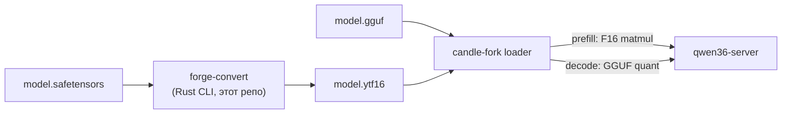

# Specification: yttri-forge Этап 1 — F16-сайдкар тяжёлых проекций

**Date:** 2026-08-24
**Priority:** P1
**Type:** New feature (конвертер + загрузчик)

## 1. Problem

Префилл стека Yttri на 1.3 медленнее llama.cpp. Профиль этапа 0 (gate пройден):
matmul-проекции = **59% времени префилла** @8K (DeltaNet proj 35% + ssm_out 24% +
attn ~1%). GGUF Q4_K_M матмулы идут через integer MMQ без tensor cores.

## 2. Goal

Префилл Qwen3.5-4B @8K быстрее llama.cpp (≥2480 ток/с) за счёт F16 tensor-core
матмулов для 9 «тяжёлых» тензоров; декод не деградирует (dual-read: decode
читает компактный GGUF-квант).

## 3. Current state

- Конвертера нет; загрузчик candle-fork читает только GGUF.
- Инструментация `QWEN36_GPROF=3` ([pfp-delta]/[pfp-attn]) — в форке `47fe1094`.
- Профиль: research.md §«Этап 0».

## 4. User scenarios

### Scenario 1: Конвертация модели (P1)
**As** владелец, **I want** одной командой получить сайдкар к существующему GGUF.

**Acceptance:**
- [ ] `forge-convert --f16-heavy <model>.safetensors -o <dir>/` создаёт
      `<stem>.ytf16` рядом с GGUF
- [ ] В .ytf16 ровно 9 групп тензоров × N слоёв (маска heavy, см. §5)
- [ ] Повторный запуск детерминирован (байт-в-байт при одинаковом входе)
- [ ] Выход ≠ safetensors модели → понятная ошибка с именем отсутствующего тензора

### Scenario 2: Загрузка пары (P1)
**As** сервер, **I want** автоматически подхватить сайдкар если он лежит рядом
с GGUF и sha256 совпадает.

**Acceptance:**
- [ ] `<gguf>` + `<stem>.ytf16` в той же папке → загрузчик мапит F16 в 9 проекций
- [ ] sha256 GGUF не совпал с манифестом → WARN + работа без сайдкара (не падать)
- [ ] Сайдкара нет → поведение идентично текущему

### Scenario 3: Производительность (P1)
**As** владелец, **I want** измеримый выигрыш.

**Acceptance:**
- [ ] Prefill @8K ≥ 2480 ток/с (llama.cpp parity)
- [ ] Decode @8K ≥ 56 ток/с (baseline без сайдкара)
- [ ] Golden-тесты: 3 промпта осмысленный текст + loss@64tok ≤ baseline+0.05

## 5. Функциональные требования

### Must Have
- **FR-001**: Контейнер `.ytf16`: заголовок (magic "YTF1", версия=1) +
  манифест JSON (`{gguf_sha256, mask:"heavy", tensors:[{name,dtype:F16,
  shape,offset}]}`) + плоские little-endian F16 буферы, выровненные 64B.
- **FR-002**: Маска `heavy` (9 имён/слой): `attn.q/k/v/o`, `dn.wqkv/wgate/
  w_beta/w_alpha`, `dn.ssm_out`. Имена резолвятся по GGUF-конвенции
  (`blk.{i}.attn_q.weight` …).
- **FR-003**: `forge-convert --f16-heavy <safetensors> [-o dir]`:
  чтение safetensors (без torch), cast→F16 LE, запись контейнера.
  BF16→F16: clamp до F16::MAX со счётом клампов в stdout (outlier-безопасность).
- **FR-004**: Загрузчик candle-fork: обнаружение `<stem>.ytf16`, проверка
  sha256(GGUF), замена QMatMul→TensorF16 для замапленных тензоров
  **во всех путях forward_prefill** (attn proj/wo, deltanet proj/head).
- **FR-005**: Dual-read инвариант: decode-путь (`forward`,
  `forward_decode_batch*`) читает GGUF-квант; F16 — только prefill-ветки.
  Debug-счётчик `QWEN36_TRACE=1`: любое обращение к F16-тензору вне prefill
  → WARN с backtrace-меткой.
- **FR-006**: Откат: `QWEN36_DISABLE_YTF16=1` → игнор сайдкара полностью.

### Should Have
- **FR-010**: `--list` режим конвертера: показать какие heavy-тензоры найдены/
  не найдены в safetensors.
- **FR-011**: Trace загрузки `[ytf] mapped {n} tensors ({MiB})`.

## 6. Non-functional

- **Perf gate**: критерии Scenario 3 на RTX 3060, SLOTS=2, CTX=16384.
- **Надёжность**: несоответствие формы тензора GGUF-метаданным → ERROR с именем.
- **Совместимость**: формат версионный (v1); неизвестная версия → отказ с сообщением.

## 7. Data model (контейнер)

```
.ytf16
├─ header: magic "YTF1" u32 | version u32 | manifest_len u32
├─ manifest JSON: { gguf_sha256, mask, tensors:[name,shape,offset,len] }
└─ data: F16 LE буферы по offset (align 64)
```

## 8. Architecture



## 9. Out of scope

- W4A16/W8A8 ядра (этап 2), калибровка (OQ-1)
- Glob-маски произвольных тензоров (этап 1.5)
- Обратный конвертер (BD-002), PyTorch-чекпоинты (BD-003)

## 10. Spec decisions

| # | Вопрос | Решение | Дата |
|---|--------|---------|------|
| D-101 | Формат сайдкара | Собственный `.ytf16` (не safetensors): полный контроль заголовка+выравнивания | 2026-08-24 |
| D-102 | Имя флага | `--f16-heavy` (семантика «тяжёлые проекции», включает ssm_out) | 2026-08-24 |

## 11. Success criteria

- [ ] Все acceptance Scenario 1–3
- [ ] Prefill ≥2480 ток/с, decode ≥56 ток/с, parity golden-тесты зелёные
- [ ] `QWEN36_DISABLE_YTF16=1` возвращает точный baseline-бенчмарк
